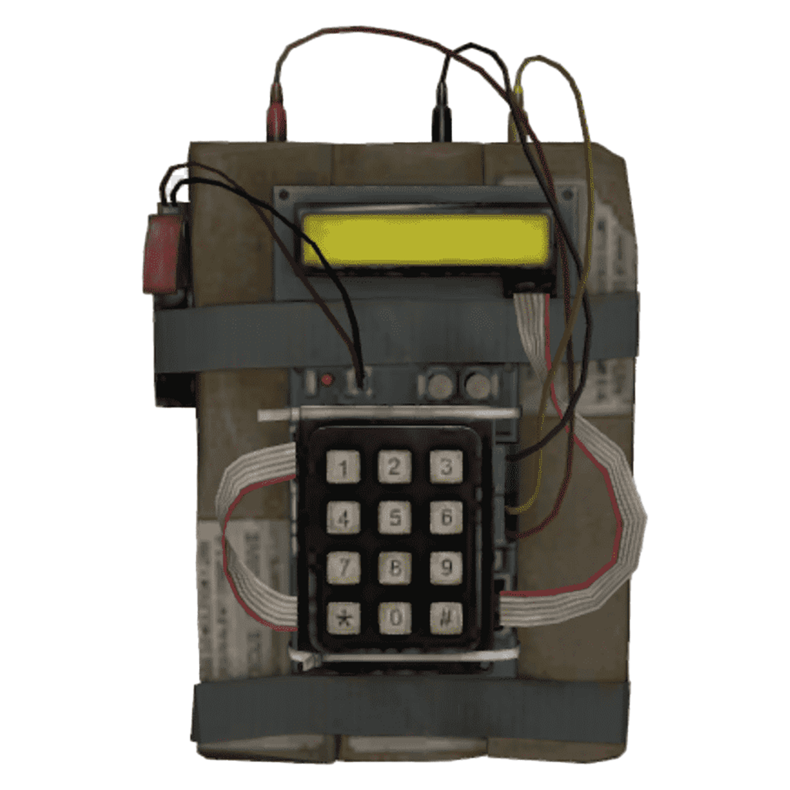

<h1 align="center">
   
  
   
  Bomb Timer
   
</h1>

A simple timer app that looks like a cs 1.6 bomb inspired by one <a href="https://www.youtube.com/@tokyospliff/featured">tokyospliff</a> uses in his streams.

### Download
Go to the <a href="https://github.com/Hyrdaboo/Bomb-Timer/releases/">releases page</a> and choose the build for your OS(windows, linux)

### Controls

Enter time in HH:MM:SS format (ex. 01:21:25 would be 12125) 
Clear with <b>Backspace</b>

<table>
  <tr>
    <th>Shortcut</th>
    <th>Descrption</th>
  </tr>
  <tr>
    <td><b>Enter</b></td>
    <td>Starts the timer</td>
  </tr>
  <tr>
    <td><b>Ctrl+R</b></td>
    <td>Resets the timer</td>
  </tr>
  <tr>
    <td><b>Ctrl+H</b></td>
    <td>Hides the timer window</td>
  </tr>
  <tr>
    <td><b>Ctrl+Q</b></td>
    <td>Closes the app</td>
  </tr>
  <tr>
    <td><b>Ctrl+(Plus key)</b></td>
    <td>Makes the timer window bigger</td>
  </tr>
  <tr>
    <td><b>Ctrl+(Minus key)</b></td>
    <td>Makes the timer window smaller</td>
  </tr>
  <tr>
    <td><b>Ctrl+(0/1/2/3/4)</b></td>
    <td>Sets the start sound to appropriate index (0 by default)</td>
  </tr>
</table>
